# BSP — Cloud-Native Blood Sugar Prediction (Research/Demo)

> **Not a medical device.** Educational & research purposes only.
> **Stack:** AWS Lambda · SageMaker Processing · App Runner · S3 · Docker · Python (Keras/TF/ONNX) · React/Kotlin

<p align="center">
  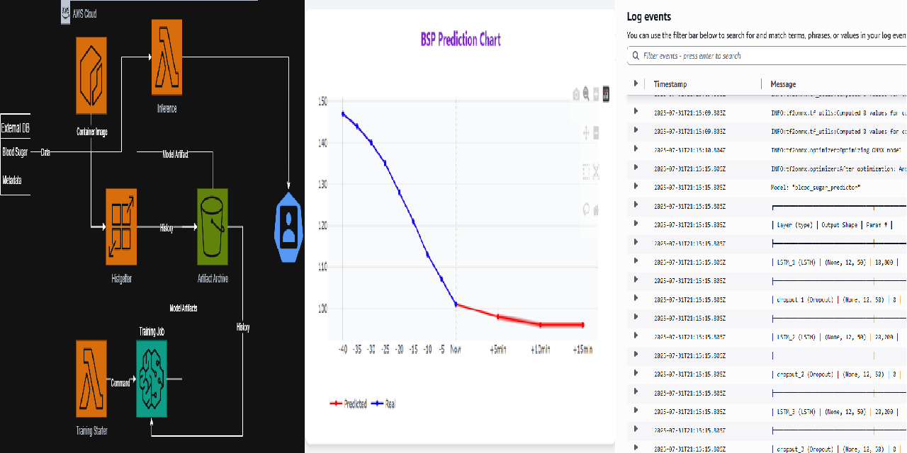
</p>

---

<p align="center">
  <a href="#"></a>
  <a href="#"></a>
  <a href="#"></a>
  <a href="#"></a>
</p>

---

## 🧭 Table of Contents

* [Why This Exists](#-why-this-exists)
* [Highlights](#-highlights)
* [Architecture](#-architecture)
* [Repository Map](#-repository-map)
* [Quickstart (Local Demo)](#-quickstart-local-demo)
* [Deploying to AWS](#-deploying-to-aws)
* [Data & Models](#-data--models)
* [Does It Actually Work?](#-does-it-actually-work)
* [Evidence](#%EF%B8%8F-evidence)
* [API Shape](#-api-shape)
* [Observability](#-observability)
* [Security & Privacy](#-security--privacy)
* [Roadmap & Lessons](#-roadmap--lessons)
* [Contributing](#-contributing)
* [License](#-license)
* [Appendix: Dev Tips](#appendix-dev-tips)

---

## 🎯 Why This Exists

This repository open-sources the **system engineering** behind a complete blood sugar prediction pipeline. The original target was production; after **patent rejection** and **app-store medical constraints**, this is released as a **research/educational demo** so others can learn, reuse, and build.

> ⚠️ **Medical Disclaimer**
> This project is **not a medical device** and must **not** be used for clinical decisions. Educational and research purposes only.

---

## ✨ Highlights

* **Modular Containers**: distinct images for **training** (SageMaker Processing) and **inference** (AWS Lambda).
* **Serverless Inference**: autoscale-to-zero + cold-start tuned.
* **Training Pipeline**: ingest CSV → train (GRU/LSTM) → evaluate → export artifacts.
* **Data Connectors**: Dexcom (via `pydexcom`) & S3 model storage.
* **Frontends (Prototype)**: React (web) & Kotlin/Jetpack Compose (Android) visualizations.
* **Production Mindset**: IaC-ready layout, env isolation, logs/metrics hooks.

<p align="center">
    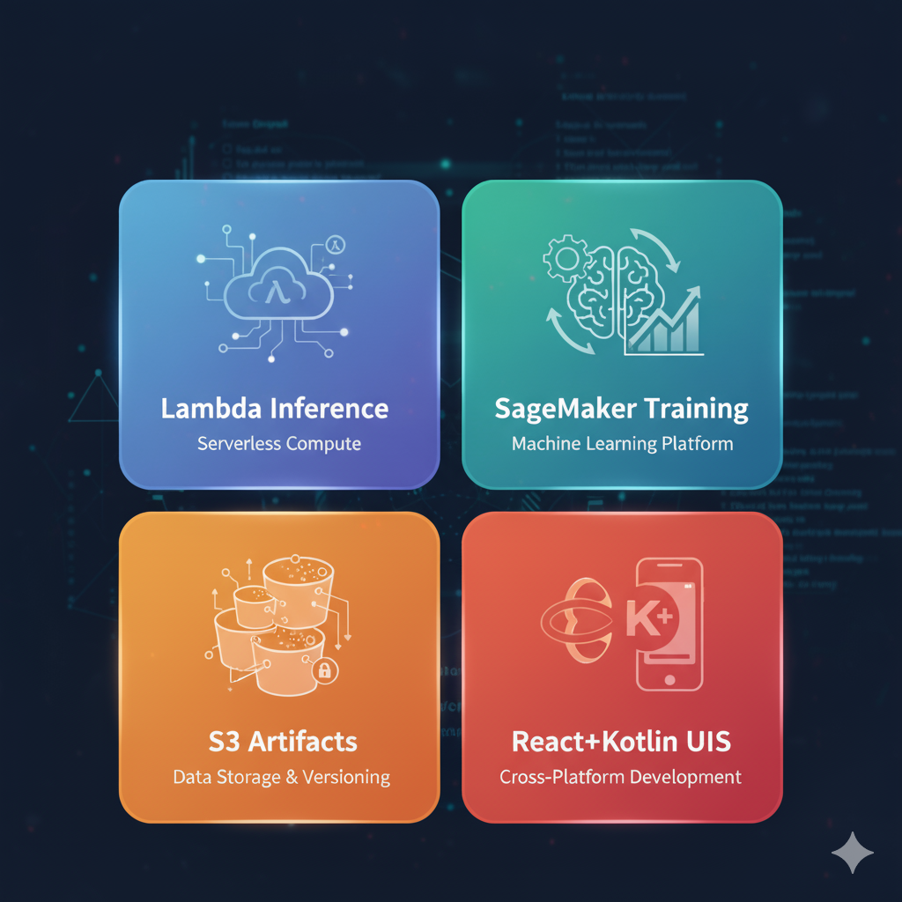
</p>

---

## 🏗️ Architecture

<p align="center">
    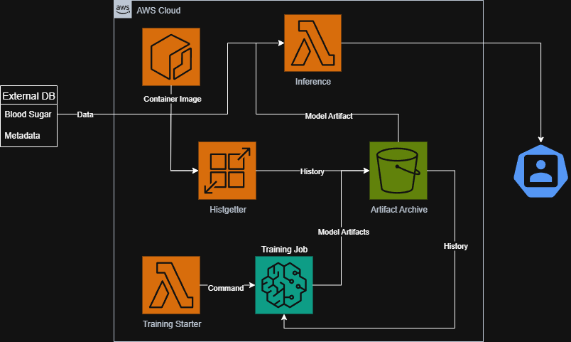
</p>

**Flow**

1. **Ingestion** pulls CGM readings (or uses synthetic CSV) → saved to **S3**.
2. **Training (SageMaker Processing)** runs RNN candidates (e.g., GRU/LSTM), evaluates, exports (`.onnx`, metrics `.json`) → **S3**.
3. **Inference (Lambda)** loads selected model from **S3** → returns **real-time predictions** + indicators.
4. **App** (React/Kotlin) renders last 12 values + next 3 predictions with confidence bands.

---

## 🔗 Related Repositories

- **blood-sugar-predictor-android** — Kotlin / Jetpack Compose Android frontend  
  https://github.com/Atakan-Kaya35/blood-sugar-predictor-android

- **blood-sugar-predictor-web** — React web frontend (Plotly visualization)  
  https://github.com/Atakan-Kaya35/blood-sugar-predictor-web

- **bsp-privacy-policy** — privacy policy published for the Google Play submission  
  https://github.com/Atakan-Kaya35/bsp-privacy-policy

- **BSP-app-process** — the earlier Flutter/Dart app attempt, April 2024  
  https://github.com/Atakan-Kaya35/BSP-app-process

---

## 🗺️ Repository Map

> Each deployable has its own **folder README** with purpose, runtime/target, entrypoint, env vars, and deployment steps.

| Path                                             | What it is                        | Runtime / Target         |
| ------------------------------------------------ | --------------------------------- | ------------------------ |
| `Inference Container/`                           | Real-time prediction service      | **AWS Lambda** (Python)  |
| `Training Container/`                            | Batch training & evaluation       | **SageMaker Processing** |
| `Histgetter Container for App Runner Sources/`   | Optional ingestion/API            | **AWS App Runner**       |
| `Histgetter Container for Lambda Source (FAIL)/` | Optional ingestion/API            | **AWS Lambda** (Python)  |
| `Models/Modern Models/`                          | Trained ONNX model bundle (10 models) | ONNX / onnxruntime   |
| `demos/evidence/`                                | Prediction charts, app screenshots, training logs | PNG      |
| `demos/`                                         | Images for Github                 | Draw.io etc.             |

---

## ⚡ Quickstart (Local Demo)

Runs locally with **synthetic data**—no PHI/PII or external creds.

```bash
# clone
git clone https://github.com/Atakan-Kaya35/BSP.git
cd BSP

# local venv for tooling
python -m venv .venv && source .venv/bin/activate

# build & run inference locally
docker build -t bsp-inference "./Inference Container"
docker run --rm -p 8080:8080 -e MODEL_PATH=/app/models/demo.onnx bsp-inference

# query
curl -X POST http://localhost:8080/predict \
  -H 'Content-Type: application/json' \
  -d @examples/request.json
```

---

## ☁️ Deploying to AWS

> Exact commands live in each folder’s README (SAM/CDK/Terraform or GitHub Actions). Below is the shape.

### Inference (Lambda)

* **Entry point:** `app.lambda_handler`
* **Inputs:** recent CGM series (or synthetic), S3 model artifact
* **Outputs:** JSON: predictions + trend + bands
* **Env vars:** `ENV`, `TMP_DIR`, `S3_BUCKET`

<p align="center">
    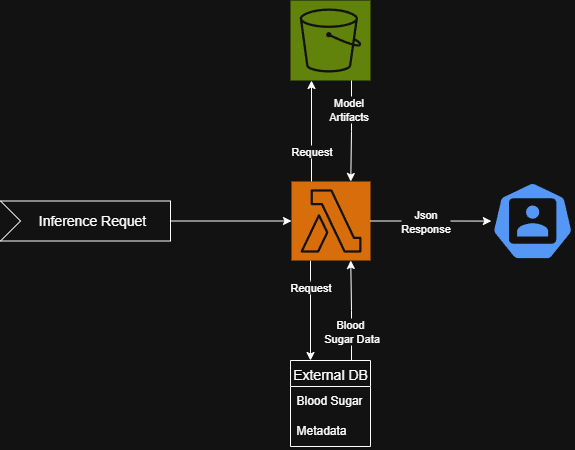
</p>

### Training (SageMaker Processing)

* **Inputs:** S3 CSV(s)
* **Args:** `--epochs`, `--batch_size`, `--early_stop_patience`, `--num_of_models`, `--acceptable_acc_score`, `--username`, `--remaining-tries`, `--num_of_layers`, `--seq_len`
* **Artifacts:** `.onnx` (or `.h5`), metrics `.json`, zipped bundle → **S3**

<p align="center">
    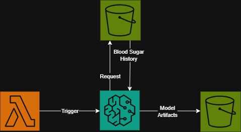
</p>

### Optional: Ingestion/API (App Runner)

* **Purpose:** scheduled fetch + normalized endpoints for downstream jobs.
* Can be replaced with a simple Dexcom→S3 step if preferred.

---

## 📦 Data & Models

* **Training data is real, not synthetic.** `atakanka350@gmail.com.csv` is 24,947 of my own Dexcom G6 readings at 5-minute resolution, 9 Apr – 7 Jul 2025. It is published deliberately: it is my own health record, and a personalised model is not reproducible without it. It contains no one else's data.
* **Model formats:** trained in Keras; exported to **ONNX** in the newest version for portable inference. Was a **h5** export previously. ONNX export was measured to be lossless; freezing weights for inference costs roughly **7%** accuracy.
* **Benchmark windows** (`BSP_*_Evaluator_Models.csv`) are hand-curated 15-point glucose sequences used to certify what each model is competent at.
* Real integrations (Dexcom via `pydexcom`) require env-based credentials (never committed).

---

## 📊 Does It Actually Work?

Held-out evaluation of the shipped 10-model ONNX ensemble, on the last 10% of the
training CSV (2,493 sequences, temporally held out — never seen during training).
415 recursive rollouts, clock advanced exactly as the inference container does.

| Horizon | Method | MAE (mg/dL) | RMSE | MARD |
|---|---|---|---|---|
| **+5 min** | **BSP ensemble** | **3.4** | **6.6** | **3.0%** |
| | persistence (assume no change) | 4.0 | 6.1 | 3.5% |
| | linear extrapolation | 4.3 | 12.8 | 3.6% |
| **+10 min** | **BSP ensemble** | **6.4** | **10.5** | **5.7%** |
| | persistence | 7.5 | 11.1 | 6.5% |
| | linear extrapolation | 9.4 | 26.8 | 7.9% |
| **+15 min** | **BSP ensemble** | **9.3** | **14.4** | **8.2%** |
| | persistence | 10.7 | 16.5 | 9.1% |
| | linear extrapolation | 14.7 | 42.9 | 12.3% |

The ensemble beats both naive baselines at every horizon. Persistence is included
because it is the honest bar: a glucose predictor that cannot beat "assume the
current value holds" is not predicting anything. But beating it on average is a
low bar, and the next table is the one that matters.

### The number that actually matters

Aggregate error flatters this model, because 65% of CGM windows are quiet and a
model that predicts "roughly the same as now" scores well on them. Split the same
test set by what the glucose actually did:

| Window type | n | MAE | RMSE |
|---|---|---|---|
| all windows | 830 | 8.9 | 14.0 |
| quiet (±10 mg/dL) | 542 | **5.1** | 7.8 |
| moving (>20 mg/dL) | 99 | **26.8** | 31.5 |
| falling fast (< −20) | 45 | **28.6** | 32.3 |

Error is five times worse exactly where the product is supposed to earn its keep.
Trained with MSE on a signal that barely moves two thirds of the time, the network
learned that predicting "no change" is the safest way to minimise loss. It is,
essentially, an expensive persistence model.

**Hypoglycemia detection at +15 min, and the ensemble bug it exposes:**

| Strategy | Events caught | Recall | Precision |
|---|---|---|---|
| ensemble **mean** (what ships today) | 3 / 34 | **8.8%** | 33% |
| best single model | 16 / 34 | 47.1% | 50% |
| ensemble **minimum** | 17 / 34 | **50.0%** | 50% |

Averaging destroys the signal. When two models see a fall to 65 and eight do not,
the mean is 133 and nothing fires. Individual models are five times better at
calling a low than their own average is. For the safety decision specifically,
the ensemble should be aggregated by minimum or a low quantile, not by mean —
same models, same infrastructure, no retraining. That change is not yet made.

Sample size is 34 hypo events from one person, enough to show a fivefold gap and
not enough to tune a threshold on.

**Read these numbers with three caveats.** They come from one person's physiology,
so they say nothing about how the approach generalises — an early experiment
training on four other people's data produced visibly worse models, which is why
BSP is per-user by design. Accuracy also degrades steeply with horizon, as any
recursive forecaster's does, since each step is fed its own previous output. And
time-of-day turns out to matter enormously: rolling the forecast forward with a
frozen clock instead of a real one nearly doubles MAE at +15 min, from 9.3 to 17.0.

---

## 🖼️ Evidence

The system running, not just its architecture.

<p align="center">
  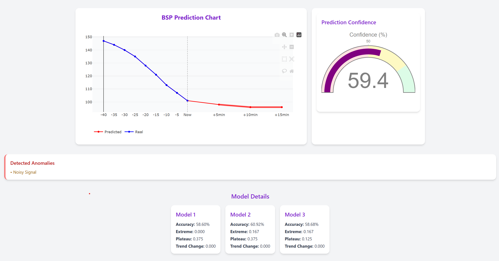
</p>

Live dashboard: 12 real readings (blue), 3 predicted (red), a confidence gauge,
detected anomalies, and per-model competency scores.

> Look closely at Model Details in that screenshot: **Trend Change reads 0.000 for
> every model.** That is not a rendering artifact — it is a real bug, visible in
> production for months, and it is the subject of the "competency scoring" commit
> in this repository's history. The models were calling trend reversals correctly
> and being scored as if they had failed.

**Prediction charts, January 2024** — blue is the recorded trace, red the forecast,
pale lines are earlier forecasts made from earlier points, so you can see the model
committing to a call and then being graded by what happened next.

| | | |
|---|---|---|
| 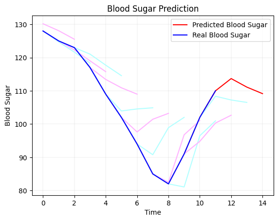 | 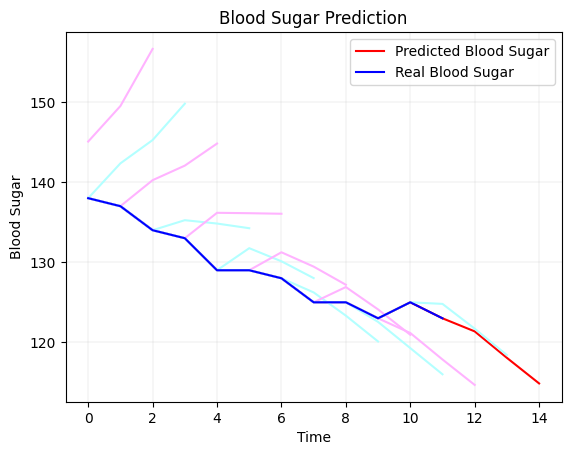 | 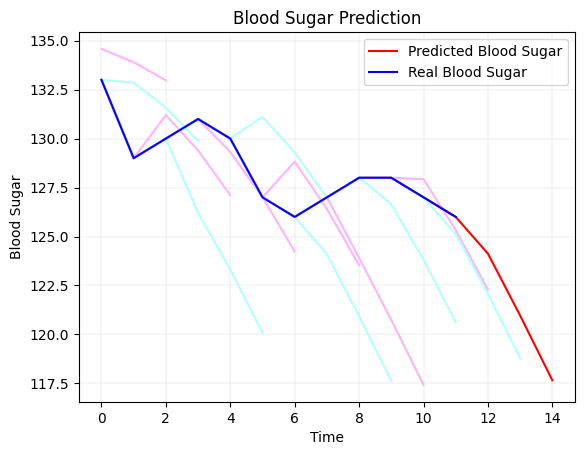 |

**And where it got it wrong** — kept deliberately, because a model gallery without
failures is marketing, not evidence.

| | |
|---|---|
| 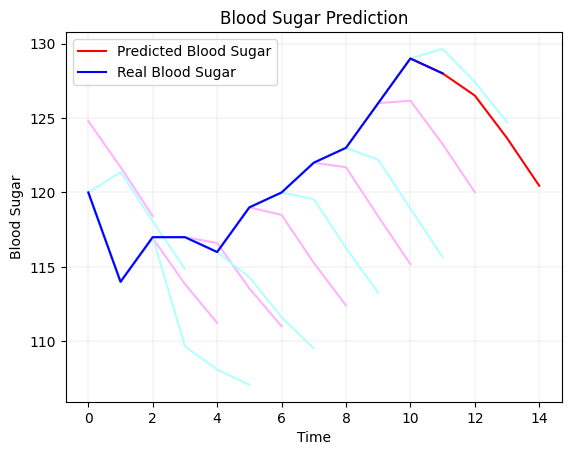 | 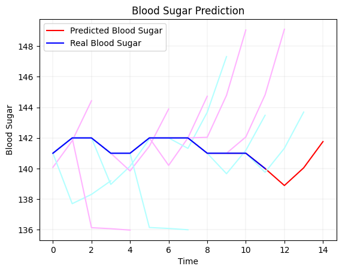 |

Seventeen further unfiltered charts from a single practice run are in
[`demos/evidence/practice-run-2024-01/`](./demos/evidence/practice-run-2024-01/),
and a SageMaker training log is at
[`demos/evidence/cloudwatch_training_log.png`](./demos/evidence/cloudwatch_training_log.png).

---

## 🔌 API Shape

**Request**

```json
{
  "username": "atakanka350@gmail.com",
  "password": "*****",
  "is_first_call": true
}
```

**Response**

```json
{
  "safeness": true,
  "trend": 27,
  "befores": 159159158,
  "befores1": 135143155,
  "befores2": 128123129,
  "afters": 156155153,
  "indicators": 20,
  "confidence": 96.58816483331636,
  "anomalies": 0,
  "model_info": [[0.0, 0.375, 0.0, 0.5859719438877755], [0.16666666666666666, 0.375, 0.0, 0.6092184368737475], [0.16666666666666666, 0.125, 0.0, 0.5867735470941884]]
}
```

---

## 📊 Observability

* **Logs:** structured JSON to stdout (CloudWatch).
* **Metrics/Alarms:** invocation latency, error rate, cold starts.
* **Traceability:** include model name/version in response `meta`.

---

## 🔐 Security & Privacy

Stated accurately, because a security section that describes an aspiration is worse than none:

* **This repository contains one person's real CGM data — mine, published by choice.** No other participant's data is here, and none ever was. If you fork this, do not treat the CSV as a template for handling anyone else's readings.
* **Credentials were leaked in early history and have been dealt with.** A hard-coded Dexcom password, and MySQL credentials for a since-abandoned database, were committed between June and September 2025. All were **rotated first**, then purged from every commit on every branch with `git filter-repo`. Rotation is what made the leak harmless; the purge is hygiene.
* **The lesson worth copying:** rotate before you purge. Rewriting history does not un-publish anything that was public for fourteen months.
* Secrets belong in **AWS Secrets Manager / SSM**, never in Git. `.gitignore` covers `.env`, `*.h5`, `*.zip`, `*.log` and `*.json`.
* **Known design debt:** the Dexcom integration relays the user's account password on every inference call, because `pydexcom` wraps the unofficial Share API. A production build should use Dexcom's official OAuth API instead. This is the single biggest architectural flaw in the system and it is not fixed here.

---

## 🧭 Roadmap & Lessons

This effort encountered **real-world walls** (patent denial, app-store medical policies). The productization path is paused, but the **engineering patterns** are reusable across time-series domains (fitness, sleep, IoT, anomaly detection).

**PR Track (Next):**

* Blog #1: *“Building a Cloud-Native CGM Predictor”*
* Blog #2: *“What Deploying Medical ML Taught Me (as a Student)”*
* 5–7 slide deck + short demo video

<p align="center">
    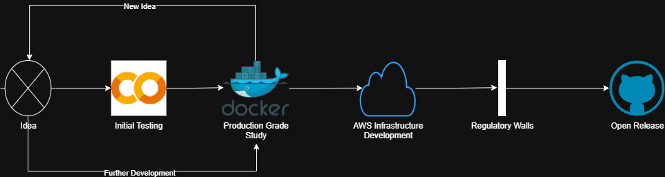
</p>

---

## 🤝 Contributing

PRs welcome for:

* Smaller, faster images & cold-start tweaks
* ONNX/TFLite inference variants
* Synthetic data generators
* Docs/diagram improvements

---

## 📜 License

MIT or Apache-2.0 **with the following notice**:

> Provided for research and educational purposes only. **Not intended for medical use.** No warranties.

---

## Appendix: Dev Tips

**Makefile convenience**

```Makefile
.PHONY: infer-build infer-run train-build
infer-build: ; docker build -t bsp-inference containers/inference
infer-run:   ; docker run --rm -p 8080:8080 -e MODEL_PATH=/app/models/demo.onnx bsp-inference
train-build: ; docker build -t bsp-trainer containers/trainer
```

**Pre-publish hygiene**

```bash
git grep -nE 'AWS_|SECRET|TOKEN|PASSWORD|PRIVATE_KEY|BEGIN RSA|BEGIN OPENSSH'
```

**Large artifacts (optional)**

```bash
git lfs install
git lfs track "*.h5" "*.onnx" "*.zip"
git add .gitattributes
```